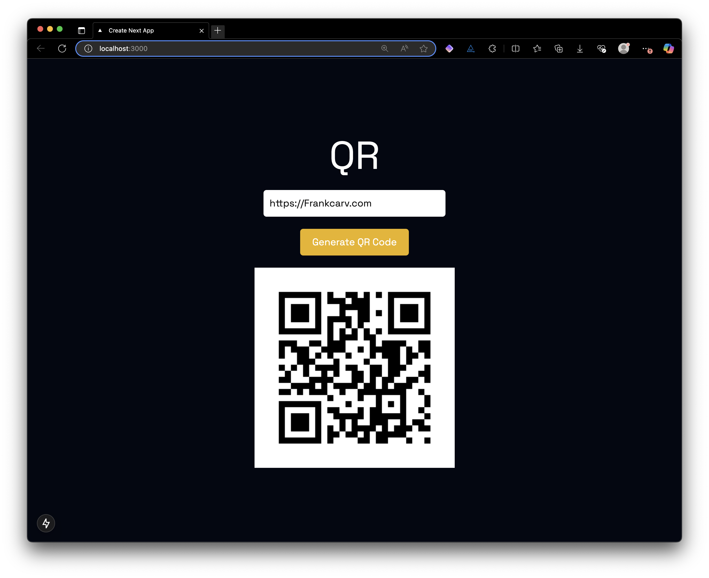

# 🪪 qr

My main purpose for this application is to utilize it primarily for DevOps purposes to practice Containerization, CICD and monitoring. Because of this, it makes the most practical sense to build a simple app that represents real world applications.

Therefore, I'll have two directories, `ui` and `api` , both which will be containerized separately eventually. I'll update this README.md as I progress. If the full stack application itself becomes interesting, I can always make it more complex.

## 🖼️ Ui

> ♟️ NextJS 15 TypeScript app with TailwindCSS & Axios for simple interaction with the API.

https://nextjs.org/docs/app/getting-started/installation

Eventually I'd like to use https://qr.io/api-documentation and create a better UX.

1. `cd ui`
2. `npm i`
3. `npm run dev` which opens the ui via Turbopack at `http://localhost:3000`

## 📦 API

> 🐍 Python using FastAPI to receive URL and generate QR codes then store the QR code in cloud storage (AWS S3 Bucket or Azure Blob Storage).

1. `python3 -m venv .venv` to create a virtualenv
2. `source .venv/bin/activate` to activate it
3. `pip install -r requirements.txt` to install the required packages
4. `touch .env` add AWS (or Azure) Access key, Secret key, & bucket name for S3 bucket,

```
AWS_ACCESS_KEY=""
AWS_SECRET_KEY=""
BUCKET_NAME="franks-bucket-name"
```

5. `uvicorn main:app --reload` to run the API server on port `http://localhost:8000`
6. `curl -X POST "http://localhost:8000/generate-qr/?url=https://frankcarv.com"` should yield a response .png

## 🛳️ DevOps : TODOS

-
-
-
-
-




